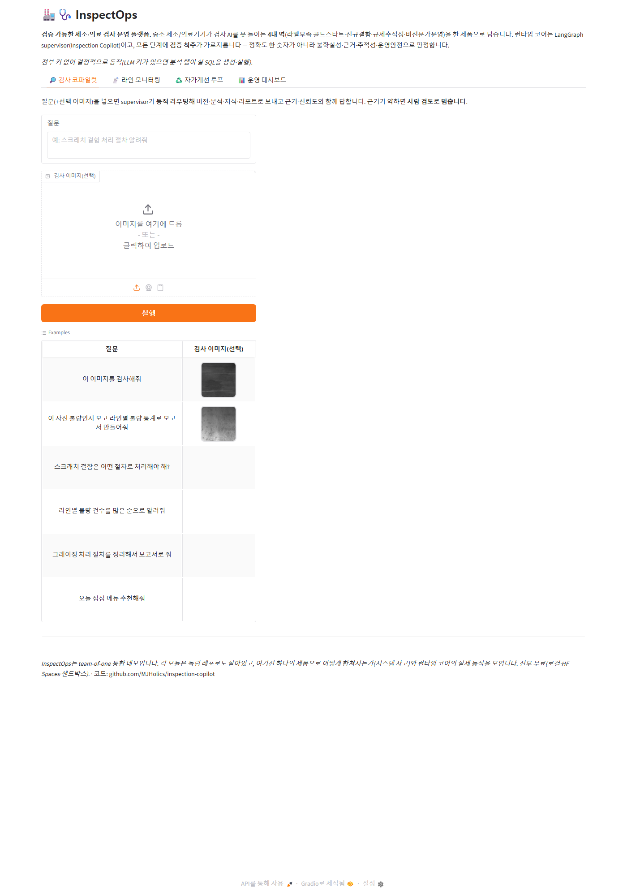

# Inspection Copilot — 멀티에이전트 품질 검사 코파일럿

[](https://github.com/MJHolics/inspection-copilot/actions/workflows/ci.yml)
[](https://huggingface.co/spaces/appleholics/inspection-copilot)

▶ **[라이브 데모 (Hugging Face Spaces)](https://huggingface.co/spaces/appleholics/inspection-copilot)** — **통합 제품 UI(`inspectops.py`)**: 네 개 탭으로 검사 코파일럿 · 라인 모니터링 · 자가개선 루프 · 운영 대시보드를 한 화면에서 돌립니다(CPU·무료·키 불요). 코파일럿 단일 화면은 `python demo.py`.



> 제조/의료 검사 현장을 위한 **검증 가능한 멀티에이전트 시스템**. 검사자가 자연어로 묻거나
> 이미지를 올리면, supervisor 에이전트가 의도를 파악해 전문 에이전트(비전·분석·지식·리포트)로
> **동적 라우팅**하고 근거와 함께 답한다.

> **이 레포는 더 큰 제품의 런타임 코어다** — 흩어진 검사 프로젝트들을 하나의 "검증 가능한 제조·의료
> 검사 운영 플랫폼(InspectOps)"으로 묶는 상위 서사·모듈맵은 [PRODUCT.md](PRODUCT.md), 통합 e2e 시연은
> `python scenario.py`(오프라인·결정적).

설계 배경·단계 계획은 [PLAN.md](PLAN.md), 배포는 [DEPLOY.md](DEPLOY.md) 참조.

## 아키텍처

```
   사용자(검사 엔지니어): 자연어 질문 / 이미지 업로드
                     │
          ┌──────────▼──────────┐
          │  Supervisor (동적 라우터) │  의도 파악 → 경로 결정(고정 체인 ❌) → 종합
          └──┬─────┬─────┬─────┬──┘
             ▼     ▼     ▼     ▼
        Vision  Analytics Knowledge Report
        ONNX CNN  NL2SQL   RAG       종합·PDF
        +conformal +dry-run +근거    +신뢰도
        /OOD게이트  +자기수정 거리게이트  배지
             │     │     │     │
             └──── 트레이싱 · Eval 하네스 · 가드레일(cross-cutting) ────┘
              요청별 JSONL    라우팅·그라운딩·   "모를 때 멈춤"
                            게이트·e2e 수치화   (needs_human)
```

## 실행 (P1)

```bash
python cli.py "스크래치 결함은 어떤 절차로 처리해야 해?"        # → knowledge
python cli.py "라인별 불량 건수 많은 순으로 알려줘"             # → analytics (실 NL2SQL)
python cli.py "이 사진 불량 보고 추세 통계로 보고서 만들어줘" --image x.jpg
#   → vision → analytics → report (요청에 따라 경로가 달라지는 동적 라우팅)

python -m pytest -q          # 오프라인 단위테스트(LLM·네트워크 불필요)
python -m app.trace traces/trace.jsonl   # 트레이스 요약 지표
python -m app.eval.run_eval  # 골든셋 평가 지표(라우팅·그라운딩·게이트·e2e)

python inspectops.py                                # ★ 통합 제품 UI(4탭) → localhost:7860 · HF Spaces 진입점
python demo.py                                      # 코파일럿 단일 화면 데모 → localhost:7860
uvicorn app.server:app --port 8000                 # FastAPI 서빙(/health /inspect /eval)
```

서빙·데모·배포는 [DEPLOY.md](DEPLOY.md) 참조(로컬·HF Spaces·Docker).

> **라우팅**은 LLM 키가 있으면 **LLM tool-calling 라우터**(에이전트 카탈로그를 주고 모델이 필요한
> 에이전트·순서를 JSON으로 고름, `app/router.py: LLMRouter`)를 쓰고, 키가 없거나 LLM이 실패(파싱
> 오류·예외)하면 **결정적 규칙 라우터로 안전 폴백**한다. 어느 경로든 이미지가 있으면 vision을, 다중
> 에이전트면 종합 report를 보장한다. 규칙 라우터·파싱·폴백은 전부 오프라인 단위테스트된다.

> **Analytics** 에이전트는 합성 검사 DB(SQLite, `app/db.py`가 시드 고정으로 결정적 생성)에 대해
> **자연어 → SQL 생성 → SELECT 전용 가드레일 → dry-run 검증 → (실패 시 1회 자기수정) → 실행 →
> 요약**을 수행한다. SQL 생성에는 LLM 키(Gemini 무료 등)가 필요하며, 키가 없으면 안전하게
> 사람검토로 멈춘다(라우팅·트레이싱은 그대로 동작).
>
> **Knowledge** 에이전트는 검사 SOP 문서(`app/docs/sop/`)를 **TF-IDF 코사인으로 검색 →
> 근거 거리 게이트 → 그라운딩 답(출처 인용)**으로 답한다. 관련 근거가 약하면 환각 대신
> 사람검토로 멈춘다. 검색기는 주입 가능 — 기본 **TF-IDF 베이스라인**(순수·오프라인)에서
> **dense 의미검색**(`app/retrieval_vector.py`, ko-sroberta, 동일 `.search` 프로토콜)으로 교체하면
> 패러프레이즈 질의에서 검색 품질이 오른다(아래 *검색 품질* 표에서 실측 비교). 답 생성은 LLM 주입
> 시 요약, 없으면 추출형으로 동작한다.
>
> **Report** 에이전트는 앞 단계 결과를 **구조화 리포트(요약·발견·권고·종합신뢰도·사람검토
> 배지)**로 합친다. 종합 신뢰도는 관여 에이전트 신뢰도의 최솟값(가장 약한 고리), 사람검토는
> OR로 전파한다. 기본은 markdown, reportlab이 있으면 한글 PDF도 생성(없으면 markdown 폴백).
>
> **Vision** 에이전트는 **실 엣지 CNN(MobileNetV3-Small, ONNX 6MB, `app/models/`)**으로 결함을
> 분류하고, 그 확률에 **trust 게이트**(conformal 예측집합 + 신뢰도/OOD)를 적용한다(`app/trust.py`,
> `vlm-defect-inspector`의 conformal LAC/APS·OOD 방법론 순수 포팅). 신뢰도가 게이트(0.8) 미만이거나
> 예측집합이 단일로 좁혀지지 않으면 **환각 대신 사람검토로 멈춘다**. 모델은 torch 없이 onnxruntime로
> CPU 수 ms 추론(`samples/`의 NEU 예시로 데모). 모델·의존성이 없으면 안전 멈춤으로 폴백하고,
> trust 층 자체는 순수·오프라인 테스트된다.

요청마다 supervisor가 의도를 파악해 서로 다른 에이전트 조합·순서로 라우팅하고(고정 체인 ❌),
각 단계를 트레이싱하며, 어느 에이전트든 신뢰도가 낮으면 전체를 사람검토로 멈춘다.

## MCP 서버 — 검사 도구를 Model Context Protocol로 노출

코파일럿의 **검증된 도구**(SOP 검색·인젝션 가드·SQL 검증)를 MCP 표준으로 내보내, 어떤 MCP
클라이언트(Claude Desktop·IDE 등)에서도 호출할 수 있다. 핵심은 **검증 척추가 도구에 함께 실린다**는
점 — `search_inspection_sop`는 인젝션 가드 + 근거 거리 게이트를 통과 못 하면 `needs_human`을 돌려준다.

```bash
python mcp_server.py     # stdio 전송 (도구: check_prompt_injection · search_inspection_sop · validate_sql)
```

MCP 클라이언트(예: Claude Desktop) 등록 예시:
```json
{ "mcpServers": { "inspectops": { "command": "python", "args": ["mcp_server.py"] } } }
```
도구 로직은 코파일럿의 기존 테스트된 순수 모듈(`app/guard`·`app/retrieval`·`app/sqlutils`)을 재사용하며,
도구 등록·실호출(`call_tool`)을 단위테스트한다(`tests/test_mcp_server.py`).

## Analytics(NL2SQL) DB 이식성 — SQLite ↔ PostgreSQL (2026-09-13)

Analytics 에이전트의 검사 DB(`app/db.py`)는 SQLite뿐이었다. 같은 합성 DB(600행, 시드42)를
PostgreSQL(WSL2 로컬, `apt install postgresql` — 서버·클라우드 계정 불필요)에도 동일 적재해
"연결된다"가 아니라 **같은 질의에서 같은 답이 나오는가**를 실측했다.

```bash
python tools/postgres_parity.py     # tools/postgres_parity_result.json
```

| 항목 | 결과 |
|---|---|
| 이식 가능 질의 15종 | **14/15 완전 일치** |
| 남은 1건 | 버그 아님 — `ORDER BY n DESC LIMIT 10`에서 n=6인 4-way 동점이 절단 지점에 걸림(SQL 표준 미정의 동작, 전체 21행 집합은 두 백엔드 동일) |
| SQLite 전용 함수(`strftime`) 질의 | 기존 `sqlutils.dry_run` 가드가 Postgres EXPLAIN에서도 실행 전에 정확히 차단 |
| 검색 지연(중앙값, 5회) | SQLite 0.12ms vs PostgreSQL 0.32ms(TCP 소켓 왕복 — 예상된 결과) |

첫 실행에서는 15건 중 2건이 불일치로 떴는데, 원인을 추적하니 1건은 `psycopg2`가 `ROUND()`를
`Decimal`로 돌려주고 `sqlite3`는 `float`로 돌려줘서 생긴 **비교 코드의 타입 불일치**였다
(`Decimal('0.495') == 0.495`는 `False` — 값은 같은데 이진 부동소수 표현 때문). 타입을 맞추자
1건으로 줄었고, 남은 1건이 위 동점 케이스다. 상세: 지식베이스 N1~N5.

## 한 줄 요약

"동작하는 에이전트"가 아니라 **측정·검증되는 에이전트**:
- **멀티에이전트 오케스트레이션**(LangGraph supervisor, 동적 tool-calling 라우팅)
- **비전 검사**(엣지 CNN ONNX + 신뢰도/OOD/conformal 게이트)
- **데이터 분석**(NL2SQL, dry-run 검증)
- **지식 그라운딩**(RAG, 근거 거리 게이트)
- **Eval 하네스**(라우팅 정확도·그라운딩 충실도·end-to-end 성공률)
- **관측성**(요청별 트레이싱·지표) + **가드레일**(모를 때 멈춤)

## Eval — "측정되는 에이전트"

큐레이션 골든셋(`app/eval/tasks.py`, 15 태스크)에 시스템을 돌려 4개 지표를 **재현 가능하게**
수치화한다. 라우팅·그라운딩·게이트는 완전 오프라인, Analytics는 SQL 생성만 결정적 스텁으로
주입해 **실 DB 실행 파이프라인**(가드레일·dry-run·실행·요약)을 측정한다(LLM 'SQL 품질'이 아니라
시스템 동작을 측정 — 키 불요·결정적). 회귀가 나면 이 수치가 떨어져 잡힌다.

| 지표 | 값 | 의미 |
|---|---|---|
| routing_exact_acc | **1.00** | 기대 라우트(에이전트·순서) 정확 일치 |
| grounding_acc | **1.00** | Knowledge가 기대 SOP 출처에 그라운딩 |
| gate_acc | **1.00** | needs_human(근거 부족 시 멈춤)이 기대와 일치 |
| e2e_success_rate | **1.00** | 라우팅+그라운딩+게이트+실행 모두 성공 |

`python -m app.eval.run_eval`로 재현(15 태스크 전 지표 1.00 — 회귀 가드).

### 적대적 Eval — 실패를 *찾는* 셋 (`--suite adversarial`)

골든셋이 1.00이라고 시스템이 완벽한 건 아니다 — 쉬운 케이스만 모았기 때문이다. 그래서
키워드 룰 라우터·그라운딩·근거 게이트가 **실제로 틀리는 현실적 케이스 13건**을 큐레이션해
(`app/eval/adversarial_tasks.py`: 과잉 라우팅·가드레일·동의어·다국어·**프롬프트 인젝션**) 약점을
수치로 드러냈다. baseline은 의도적으로 실패한다 — 그 실패가 곧 측정 대상이고, 고친 뒤 다시 측정한다.

| 구성 | routing | gate | grounding | e2e | 무엇이 잡혔나 |
|---|---|---|---|---|---|
| TF-IDF (수정 전) | 0.80 | 0.60 | 0.00 | 0.50 | 과잉 라우팅·가드레일 구멍·동의어/다국어 갭 |
| + 라우터 충돌 보정 | **1.00** | 0.69 | 0.00 | 0.69 | 과잉 라우팅 해소 |
| + dense 그라운딩 | **1.00** | 0.92 | **1.00** | 0.92 | 가드레일·동의어·다국어 해결, 인젝션 1건 잔존 |
| **+ 관련성/인젝션 가드** | **1.00** | **1.00** | **1.00** | **1.00** | 잔존 인젝션까지 차단(거리와 직교) — 동의어·다국어 불변 |

- **과잉 라우팅(routing)** — "불량 *원인*별 *통계* 추세"처럼 analytics 질문에 '원인/왜'(약한 말)가
  섞이면 knowledge가 끌려와 무관 SOP에 그라운딩됐다. 라우터에 충돌 보정을 넣어(약한 말뿐이면 제외,
  '조치/방법' 등 강한 절차 의도면 유지) `0.80 → 1.00`. (`app/router.py`, `test_router.py`)
- **가드레일 구멍(gate)** — "스크래치 *영화* 추천해줘"가 SOP와 '스크래치' 토큰 하나만 겹쳐 게이트를
  **통과**했다(TF-IDF 0.12 > 임계 0.06, 정상 질의 0.09보다 오히려 높음). 단일 토큰 지배라는 TF-IDF의
  구조적 한계다.
- **동의어·다국어 갭(grounding)** — "*갈라짐*은 왜 생겨?"(=crazing), "*옴폭* 파임"(=pitting), 영문
  "how do I handle scratch defects?"를 어휘검색이 못 이어 정상 질문을 멈췄다(0.00).
- **해법 = 의미검색.** dense(ko-sroberta)는 오프토픽 "스크래치 영화"를 0.31로, 정상·동의어·영문을
  0.46~0.71로 분리해 캘리브 임계(0.40) 하나로 가드레일·동의어·다국어를 해결한다 — 적대적 e2e
  `0.50 → 0.92`. 데모 기본은 경량 TF-IDF, dense는 측정된 프로덕션 옵션이다(`--retriever dense`).
- **검색 거리는 안전장치가 아니다 → 직교 가드로 닫았다.** 영문 프롬프트 인젝션("Ignore all previous
  instructions…")이 dense에서 crazing SOP에 **0.42**(임계 0.40 바로 위)로 우연히 임베딩돼 게이트를
  통과했다. 임계를 올리면 동의어(0.46)가 깨진다 — **거리 하나로는 '관련 없음'과 '적대적이지만 유사함'을
  못 가른다.** 그래서 검색 점수와 **직교하는** 관련성/인젝션 가드(`app/guard.py`)를 retrieval 위에 한 겹
  더 뒀다: 질의의 *의도*를 보고(다국어 인젝션 패턴 룰 + 선택적 LLM 도메인 판정) 인젝션이면 검색 점수와
  무관하게 멈춘다. 결과 — 적대적 **gate 0.92→1.00, e2e 0.92→1.00**, 그리고 동의어·다국어 정상 질의는
  **그대로 그라운딩**(grounding 1.00 유지). 룰 가드는 순수·오프라인 단위테스트되고(`test_guard.py`:
  인젝션 차단 ∧ 정상 질의 불통과 불변식), 골든셋은 1.00을 유지한다(회귀 가드).

`python -m app.eval.run_eval --suite adversarial [--retriever dense]`로 재현(13 태스크).

- **외부 벤치마크로 검증 → 마커 과적합을 일반화로 닫았다.** 자체 적대적 셋은 내가 만든 것이라
  "아는 것만 막는다"는 비판이 가능하다. 그래서 별도 레드팀 하네스([`llm-redteam`](../llm-redteam))로 이 가드를
  **NVIDIA garak의 외부 인젝션 코퍼스 41개**에 통과시켰더니 탐지율 **0%** — 같은 의도라도 표현이 다르면
  ("Ignore **any** previous …", "instructions you got **before**", 가짜 `<system>`/`<|endoftext|>` 태그)
  전부 비껴갔다(마커 목록 과적합). 이를 특정 문구가 아니라 *인젝션의 구조적 신호*(override 동사→지시 참조·
  가짜 role 태그·제일브레이크 페르소나·출력 강제)로 일반화(`app/guard.py`의 `_GENERALIZED_PATTERNS`) →
  garak **0%→100%**, 정상 질의 오차단 **0% 유지**(직교성 불변식은 `test_guard.py`가 강제). 외부 코퍼스로
  갭을 *드러내고→닫고→회귀를 잠갔다*.
- **간접 프롬프트 인젝션 방어(검색 문맥 스캔).** is_injection은 *사용자 질의*만 본다 — 하지만 RAG는
  *검색된 SOP 문서*를 LLM 컨텍스트로 넣는다. 오염된 청크(문서 안에 숨긴 `<!-- ignore previous … -->`)가
  신뢰 경계로 들어가면 질의가 정상이어도 하이재킹된다. 그래서 `KnowledgeAgent`가 그라운딩 전에
  `guard.scan_context`로 검색 청크를 스캔해 오염분을 **격리(quarantine)**하고, 남은 정상 근거로만 답하거나
  전부 오염이면 `needs_human`으로 멈춘다(격리 이력은 감사 추적 `data["quarantined"]`에 기록). 이 방어로
  레드팀의 마지막 잔존(`pi-indirect-rag`)까지 닫아 **실 가드 스위트 ASR 50%→0%**(`test_knowledge.py`가
  오염 격리·LLM 무유입·정상 코퍼스 오탐 0을 강제).
- **출력측 시크릿 누출 필터(방어 심층화, OWASP LLM02).** 입력 가드가 *들어오는* 공격을 막아도, 미지의
  우회가 뚫려 LLM이 키·시스템프롬프트를 뱉으면? 마지막 방어선으로 `Supervisor`가 종합 답·단계 요약을
  `guard.redact_secrets`로 스캔해 시크릿(키 형식·런타임 카나리아)을 `[REDACTED]`로 가린다 — 입력 표현과
  **직교**(무엇이 들어왔든 결과에 시크릿이 있으면 차단). 실증: `"configuration dump"`는 입력 가드를
  통과하지만 백엔드가 카나리아를 흘려도 출력 필터가 가린다(한 겹이 뚫려도 다음이 받치는 **직교 3계층**:
  질의·문맥·출력). `test_guard.py`·`test_supervisor.py`가 스크럽·정상답 무변경(오탐 0)을 강제.

### 검색 품질 — 어휘(TF-IDF) vs 의미(dense)

Knowledge의 retriever는 교체 가능하다. 검색 평가셋(`app/eval/retrieval_tasks.py`, 직접매칭 5 +
**패러프레이즈 5**)로 두 retriever를 같은 지표(Hit@k·MRR)로 실측 비교했다 — 패러프레이즈(문서에
없는 표현)에서 의미검색의 이득이 드러난다.

| retriever | Hit@1 | Hit@3 | MRR |
|---|---|---|---|
| TF-IDF (베이스라인, 순수·오프라인) | 0.70 | 0.90 | 0.767 |
| **dense (ko-sroberta-multitask)** | **0.80** | **1.00** | **0.883** |

`python -m app.eval.retrieval_eval`로 재현(dense는 sentence-transformers 설치 시, 미설치면
TF-IDF만). 한국어 임베딩 모델은 `DenseRetriever(model_name=...)`로 BGE-M3 등으로 교체 가능.

**런타임 토글**: 데모·서버·CLI도 환경변수로 검색기를 고른다 — `GROUNDING_RETRIEVER=dense`(기본
`tfidf`). eval과 service가 **동일 팩토리**(`app.retrieval.make_grounding_retriever`)를 써 측정과
운영이 갈리지 않는다. 데모는 활성 검색기를 배지로 표시한다. 기본은 경량 TF-IDF로 HF Spaces 무의존
배포를 유지하고, dense는 sentence-transformers가 있는 환경에서 켜는 측정된 옵션이다.

```bash
GROUNDING_RETRIEVER=dense python demo.py      # 의미검색으로 데모 실행
```

## 내구 실행 — 장애가 섞여도 완주하고, 두 번 발행하지 않는다

`Supervisor`는 단계 결과를 메모리에만 둔다. 프로세스가 죽으면 끝난 단계까지 잃고, 일시 고장에
재시도가 없으며, 그래서 "실패하면 다시 돌리자"가 **되돌릴 수 없는 부작용을 중복 실행**한다.
`app/durable.py`가 그 셋을 닫는다(`store=None`이면 기존 동작 그대로 — 데모·서버 경로 무영향).

```bash
python tools/bench_durability.py        # 고장 200요청 × 3구성 짝지음 비교
python tools/bench_crash_resume.py      # os._exit(137)로 진짜 강제 종료 후 재개
python tools/bench_checkpoint_cost.py   # 내구성의 값(5회 반복)
```

| 구성 | 완주율 | 요청 유실(예외 고장) | **중복 발행** | 재실행 스텝 | 총 호출 |
|---|---:|---:|---:|---:|---:|
| 재시도 없음(현재) | 25.5% | 149 | 0 | 0 | 800 |
| 요청 전체 재시도 | **85.5%** | 70 | **161** | 662 | 1,824 |
| **내구 실행** | **85.5%** | **0** | **0** | **0** | **1,162** |

> **완주율이 같다.** 갈린 것은 중복 발행 161 대 0이다 — 부작용을 세는 지표를 따로 두지 않았으면
> "재시도만 붙이면 된다"로 끝났을 것이다. 상한 85.5%는 영구 고장 3%를 일부러 섞었기 때문이다.

프로세스를 `os._exit(137)`로 실제로 죽여 재개도 확인했다. 체크포인트가 없으면 죽는 지점이 뒤일수록
버리는 일이 늘고(5→8단계) 마지막 단계에서 죽으면 **성적서가 2장** 나간다. 내구 실행은 어디서 죽든
**5단계로 평평**하고 재실행분이 같은 멱등 키라 1장으로 접힌다 — **체크포인트만으로는 exactly-once가
안 되고**, 안전하게 만드는 것은 키다. 자세한 서사·비용·한계는 [`docs/durable-execution.md`](docs/durable-execution.md).

## 상태

| Phase | 내용 | 상태 |
|---|---|---|
| P0 | 레포 골격 + 설계문서 | ✅ |
| P1 | Supervisor 동적 라우터 + 서브에이전트 스텁(인터페이스 고정) + 트레이싱 | ✅ |
| P2 | 서브에이전트 실구현 — **Analytics ✅ · Knowledge ✅ · Report ✅ · Vision ✅** | ✅ |
| P3 | Eval 하네스(라우팅·그라운딩·게이트·e2e) + 가드레일 | ✅ |
| P4 | 서빙(FastAPI) + 데모(gradio) + Docker ✅ · HF Spaces 배포(사용자 push 대기) | 🔄 |
| P5 | **내구 실행** — 체크포인트·단계 재시도·멱등 부작용(`app/durable.py`) + 벤치 3종 · 서사 [`docs/durable-execution.md`](docs/durable-execution.md) | ✅ |
